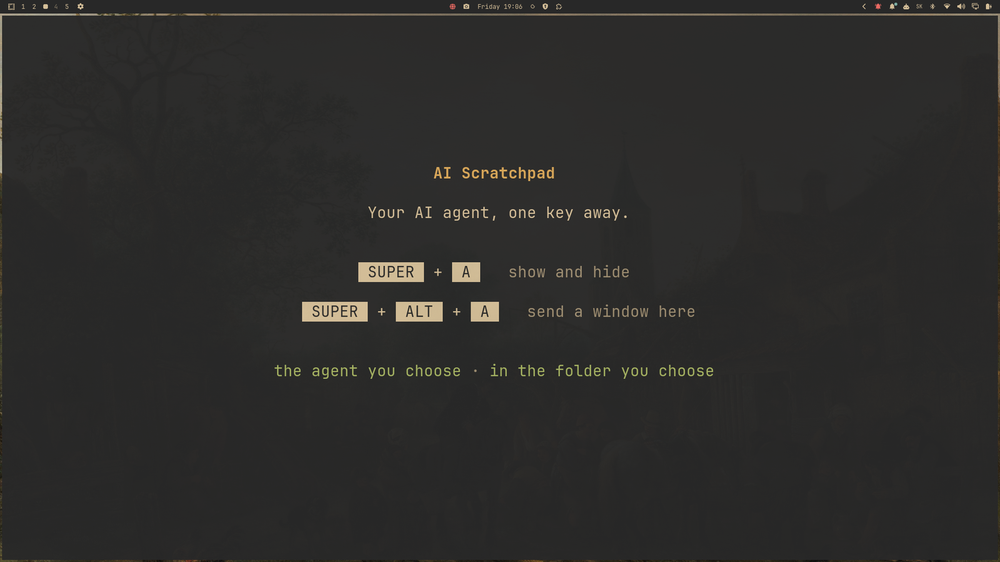
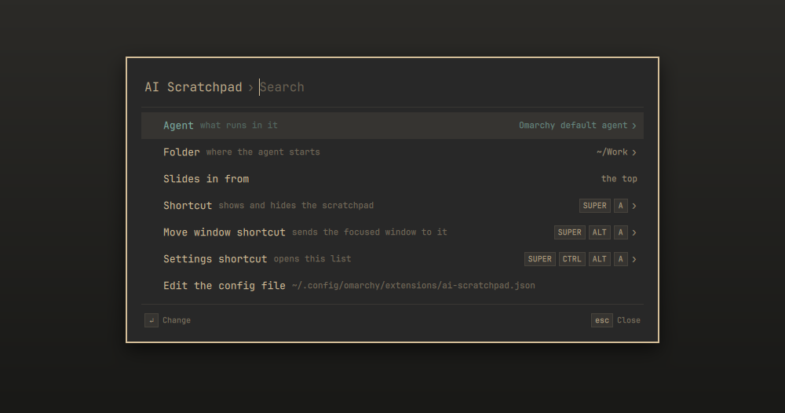
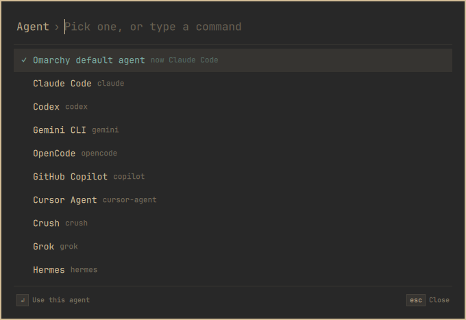
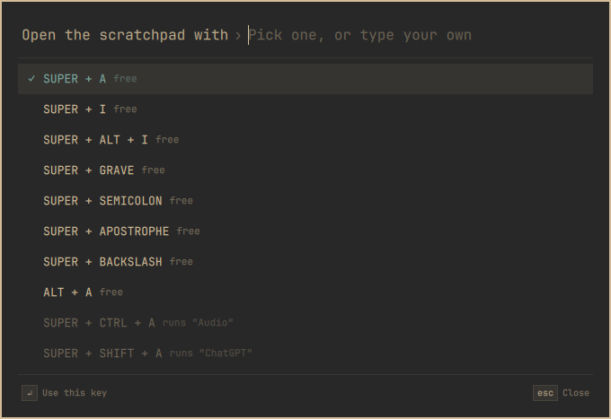

# AI Scratchpad

An Omarchy plugin that keeps your AI agent one key away, in a scratchpad of its
own.

Press **Super + A** and a full-screen terminal slides in from the top with the
agent running in your work folder. Press it again and it slides away; the
agent keeps running. The regular scratchpad (Super + S) is separate and stays
as it is.



## Install

Requires Omarchy 4.

```bash
omarchy plugin add https://github.com/MaNi4/omarchy-ai-scratchpad --enable
```

The first time, a notification tells you the key. Click it to open the
settings. If Omarchy has no default agent yet, the scratchpad asks which one
to run the first time you open it.

The plugin uses `jq` and `gum`. Both are part of a standard Omarchy install.

Omarchy reloads a plugin when it is updated, but the running shell keeps the
previous version of this one. After an update, run `omarchy restart shell`.

## Usage

| Key | Action |
|---|---|
| Super + A | Show or hide the AI scratchpad |
| Super + Alt + A | Move the focused window to the AI scratchpad |
| Super + Ctrl + Alt + A | Open the settings: agent, folder and shortcuts |

Opening the scratchpad while it is empty starts the agent. Quitting the agent
leaves a shell in the same folder; closing the terminal empties the scratchpad,
and the next time you open it the agent starts again. The terminal is the one
set as Omarchy's default.

## Settings

Press **Super + Ctrl + Alt + A**, or run:

```bash
omarchy-shell shell summon mani4.ai-scratchpad '{}'
```



| Setting | What it is | Default |
|---|---|---|
| Agent | What runs in it: the agent you chose as Omarchy's default, or Claude Code, Codex, Gemini CLI, OpenCode and others, or a command of your own, for example `claude --continue` | Omarchy default agent |
| Folder | Where the agent starts. Type a path; Tab opens the selected folder. If the folder is gone, the agent starts in your home folder | ~/Work |
| Slides in from | The top, or the bottom like the regular scratchpad | The top |
| Shortcut | The key that shows and hides the scratchpad | Super + A |
| Move window shortcut | The key that sends the focused window to it | Super + Alt + A |
| Settings shortcut | The key that opens the settings | Super + Ctrl + Alt + A |

**The Omarchy default agent**

- It runs `omarchy agent`: the agent set with `omarchy default agent <name>`.
- With no default chosen yet, the scratchpad asks which one to run. Your choice
  becomes Omarchy's default, and Omarchy installs it if it is not yet. Esc
  closes the terminal, and it asks again the next time.
- To start an agent plainly instead, choose it by name.

> [!WARNING]
> "Omarchy default agent" is the default here, and Omarchy starts most agents
> in the mode that does not ask for permission: the agent runs commands and
> changes files without stopping to ask first, with access to everything your
> user can reach. An agent chosen by name, or a command of your own, starts
> the way that agent starts by itself, which for most means it asks.

Agents that are not installed are listed but dimmed. A new agent or folder
applies to an agent that starts after the change. If one is running, the
settings ask whether to restart it now, which ends what is running in it, or
to keep it; then the change applies the next time the scratchpad is opened
empty. This works the same for every agent.



To open one setting directly, pass its name: `'{"setup": "hotkey"}'`,
`"moveHotkey"`, `"settingsHotkey"`, `"agent"` or `"folder"`.

### Shortcuts that are taken

The plugin never overrides a shortcut that is already in use. You get one
notification that names every shortcut that is taken. Click it to choose from a
list of free shortcuts, or type your own, for example `super + alt + i`; the
settings mark the taken ones. The list shows whether a shortcut is
free and, if not, what it is bound to. Choose "No shortcut" to bind the action
yourself, or not at all.



### The config file

The settings are saved to `~/.config/omarchy/extensions/ai-scratchpad.json`.
You can edit the file directly ("Edit the config file" in the settings opens
it); changes apply as soon as you save it.
The plugin makes the file readable by you alone, because the agent's command
may hold a key, as in `API_KEY=... my-agent`. A file you make or replace
yourself is closed to others as soon as the plugin loads it; give it mode 600
from the start if it holds a key.

If the file is not valid JSON, the plugin leaves it as it is: the settings
change nothing until it is fixed, and the scratchpad opens a plain shell that
says so, with no agent.

```json
{
  "hotkey": "SUPER + A",
  "moveHotkey": "SUPER + ALT + A",
  "settingsHotkey": "SUPER + CTRL + ALT + A",
  "agent": "omarchy agent --inline --pick",
  "folder": "~/Work",
  "slide": "top"
}
```

<details>
<summary>Running the shortcuts from the keybindings menu (Super + K)</summary>

The keybindings menu (Super + K) lists the shortcuts, but pressing Enter on one
does nothing: the menu can only run shortcuts that are written in the Hyprland
config. If you want that, choose "No shortcut" for each one in the settings and
bind them yourself in `~/.config/hypr/bindings.lua`:

```lua
o.bind("SUPER + A", "AI scratchpad", [[hyprctl eval 'if ai_scratchpad_toggle then ai_scratchpad_toggle() else hl.dispatch(hl.dsp.workspace.toggle_special("ai")) end']])
o.bind("SUPER + ALT + A", "Move window to the AI scratchpad", hl.dsp.window.move({ workspace = "special:ai", follow = false }))
o.bind("SUPER + CTRL + ALT + A", "Settings of the AI scratchpad", "omarchy-shell shell toggle mani4.ai-scratchpad '{}'")
```

Keep these descriptions different from the plugin's own, which it uses to find
the shortcuts it set. The first line goes through the plugin's own toggle, so
"Slides in from" keeps working.

</details>

**Tested with.** Omarchy 4.0.4, Hyprland 0.56 and Ghostty 1.3. Claude Code as
the agent, both chosen by name and as Omarchy's default, and Pi through the
choice on the first run, including its install. The other agents Omarchy offers
start through the same Omarchy command, but have not been run.

## Uninstall

```bash
omarchy plugin remove mani4.ai-scratchpad
rm -f ~/.config/omarchy/extensions/ai-scratchpad.json
```

The shortcuts are removed together with the plugin.

## How it works

Nothing runs in the background. `Service.qml` sets the scratchpad up in the
running Hyprland session with `hyprctl eval`, without editing any config file:
the shortcuts, and a rule that runs `bin/ai-scratchpad` when the special
workspace `ai` is opened empty. It does so again after each config reload,
because Hyprland drops runtime bindings and rules when it reloads.

`bin/ai-scratchpad` reads the config file and starts the agent in a terminal.
`Settings.qml` draws the settings, `Hotkey.js` handles the shortcuts and
`Config.js` the config file.

## Development

```bash
cd ~/.config/omarchy/plugins/mani4.ai-scratchpad
node tests/run.js                 # tests for Config.js, Hotkey.js and bin/ai-scratchpad
omarchy restart shell             # the QML is kept loaded: a change to it needs this
AI_SCRATCHPAD_DIRS='~/Pro' bin/ai-scratchpad --dirs  # the folders a typed path may mean
```

The tests cover the logic in `Config.js`, `Hotkey.js` and `bin/ai-scratchpad`.
The QML draws and wires it; check that by hand before a release:

1. Super + A slides the scratchpad in from the top and starts the agent; again hides it.
2. Super + Alt + A moves the focused window to it.
3. After `hyprctl reload` all three shortcuts still work.
4. Set two shortcuts to taken keys: one notification names both, and the settings mark them.
5. Change the folder while the agent runs: "Restart the agent now" starts it in the new folder, "Keep it running" leaves it.
6. Disable the plugin: the three shortcuts are gone from `hyprctl binds`.
7. With the AI scratchpad shown, Super + S brings the regular scratchpad up from the bottom, as always.
8. With no default agent in Omarchy, the scratchpad asks for one: Esc closes it, a choice starts that agent once.

Two things that shaped the code:

- Hyprland has one slide direction for all special workspaces. The shortcut
  sets it, toggles, and puts back exactly what was configured, at once: the
  slide that has started keeps its direction and the regular scratchpad keeps
  its own.
  When something else hides the AI scratchpad, such as Super + S or a change
  of workspace, it leaves the regular way.
- Other users of a machine can read a process's arguments. The folder and the
  agent's command are read inside the terminal, the settings are saved over
  stdin and a path being typed travels in the environment, so neither the
  command nor a folder is in an argument or a notification. Key combinations
  are: they are bound through `hyprctl eval`. What the agent itself is started
  with is its own command line.

## License

MIT
